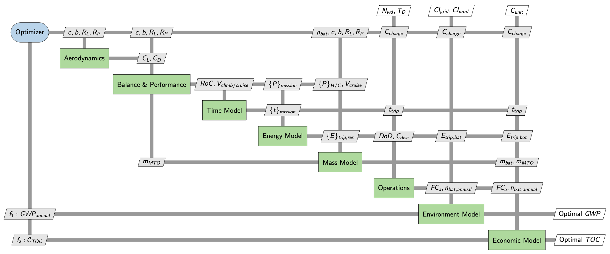

# eVTOL Multidisciplinary Design Optimization (MDO) Tutorial

[](https://mybinder.org/v2/gh/JohannesJanning/openmdao-evtol-tutorial/HEAD?urlpath=%2Fdoc%2Ftree%2F01_optimize_SOO.ipynb)

This repository provides an interactive tutorial for the conceptual design and optimization of a lift+cruise Electric Vertical Take-off and Landing (eVTOL) aircraft. It enables you to easily explore the conceptual trade-offs between environmental sustainability and economic viability in future urban air mobility.

---

# 1. Research Context

The models and optimization logic provided here are based on the multidisciplinary design optimization framework introduced in the following paper:

> **Janning, J., Armanini, S. F., & Fasel, U. (2025).** [Future pathways for eVTOLs: A design optimization perspective](https://doi.org/10.48550/arXiv.2412.18078). *arXiv:2412.18078 [eess.SY]*.

The framework integrates conventional aircraft design elements with operational cost models to capture stakeholder-centric objectives, such as profit modeling, cost-efficiency, and sustainability strategies.

<p align="center">

</p>

**Figure 1:** [eXtended Design Structure Matrix](https://openmdao.github.io/PracticalMDO/Notebooks/ModelConstruction/understanding_xdsm_diagrams.html) of the provided design optimization problem. Figure includes single objectives of min. annual GWP (kg CO2e) and min. total operating cost (TOC) (€) per flight as example, that can be adjusted (see tutorial in Section 5).

---

# 2. Technical Framework

The project utilizes the following computational stack:

- **[OpenMDAO](https://github.com/OpenMDAO/OpenMDAO)**: An open-source framework for multidisciplinary analysis and optimization. It manages the coupling between multiple analysis blocks, like aerodynamics, mass estimation, energy requirements, and cost models.

- **[JAX](https://github.com/jax-ml/jax)**: A library for composable transformations of Python and NumPy programs. It enables efficient gradient-based optimization through automatic differentiation.

---

# 3. Getting Started

## Accessing the Workspace

Click the Binder badge at the top of this page to launch a cloud-resident JupyterLab session. All necessary dependencies are pre-installed in the container environment.


---

# 4. Repository Structure

- **01_optimize_SOO.ipynb**  
  Primary interactive tutorial notebooks for single-objective optimization (SOO). '02_optimize_SOO.ipynb' and '03_optimize_SOO.ipynb' are identical and can be used simulaneously. As the objective function is adjustable, either notebook can be used for the tasks in Section 5.

- **01_optimize_MOO.ipynb**
  Interative tutorial notebook for weighted multi-objective optimization (MOO), 

- **src/**  
  The core source code directory.

  - **models_jax/**  
    Physics and cost components implemented in JAX.

  - **Components/**  
    Components defining the OpenMDAO model.

  - **parameters.py**  
    Central configuration for aircraft constants and mission assumptions.

  - **analysis/**  
    Post-optimization processing and evaluation scripts.

- **src/results/**  
  Directory where generated Excel reports are stored.

---

## Optimization Workflows

The tutorial consists of two primary notebook: **01_optimize_SOO.ipynb**, and **01_optimize_MOO.ipynb**
The notebook 02/03_optimize_SOO.ipynb are identical and can be used as secondary comparison notebooks.
To execute a study, open a notebook and select: "Run > Run All Cells" from the top menu.

---

# 5. Interactive Optimization Tutorials

Follow these tasks to explore the multidisciplinary coupling of the eVTOL framework.

## Notes

⚠️ If the Binder environment crashes, freezes, or does not execute any cells, go to *"Run"<"Restart Kernel and Run All Cells…"* to restart the session and execute the notebook from the beginning.

You may find this helpful:

**GWP_flight Optimal design vector**

```
[14.999999999999998, 1.0, 1.3539263009458526, 1.6803959009972345, 400.0, 1.0000000000000007]
```

**TOC_flight Optimal design vector**

```
[9.874446571073564, 1.0, 0.8561370588805344, 1.394907761845594, 399.99999999999994, 2.0253538731700154]
```

---

# Task 1: Design Trade-offs

Goal: Understand how the selection of an objective function dictates the physical architecture.

## 1.1 Comparing Objectives

1. Start the notebook (**01_optimize_SOO.ipynb**). 
2. Cell 2.3: Set objective to minimize **GWP_flight** (set ref: 20).
3. Run the optimization.
4. Copy the resulting **Optimal Design Vector** from cell 4 into the **baseline_vector** in cell 5.
5. Cell 2.3: Change objective to minimize **TOC_flight** (set ref: 100).
6. Run the optimization and compare results in the Dashboard (output of cell 5).

*Observe how these two design variables sets introduce tradeoffs in environmental impact and operational costs.*

---

## 1.2 Environmental Optimization

1. Optional: start the notebook (**01_optimize_SOO.ipynb**). 
2. Set the optimal design vector for minimize **GWP_flight** into the **baseline_vector** in cell 5.
3. Cell 2.3: Change objective to minimize **GWP_annual_ops** (set ref: 50000).
4. Run the optimization and compare results in the Dashboard (output of cell 5).

*Notice how optimizing for an isloated event (single flight) vs. a a long-term operational timeline (a whole year) shifts the design and output.*

---

## 1.3 Economic Optimization

1. Optional: start the notebook (**01_optimize_SOO.ipynb**). 
2. Cell 2.3: Set objective to minimize **TOC_flight** (set ref: 100).
3. Run the optimization.
4. Copy the Optimal Design Vector into the **baseline_vector** in cell 5.
5. Cell 2.3: Set objective to maximize **Annual_Profit**.

Note: Use **ref = -1000000** (The negative sign enables maximization in OpenMDAO's minimization-based solver).

6. Run and compare (output of cell 5).

*Identify the utilization trade-off: Notice how the optimizer prioritizes high-frequency operations across an annual timescale by sacrificing per-trip cost efficiency.*

---

## 1.4 Multi-Objective Optimization

1. Start with the notebook (**01_optimize_MOO.ipynb**). 
2. From Task 1.3, keep the optimal design vector to maximize **Annual_Profit** in the **baseline_vector** in cell 5.
3. In Cell 2.3: for the 'combined_obj' set **Annual_Profit** as first objective, with 'ref_1=-1e6' and 'w_1=0.5' and **GWP_flight** with 'ref_2=20' and 'w_2=0.5'. 
4. In the 'add_objective'-term, set objective to 'obj', and 'ref=1'. 
5. Run the multi-objective optimization. 

*Notice how the optimal design adapts to combined annual profit-maximizing and per-flight environmental-aware design.*

---

# Task 2: Shifting the bounds

Goal: Observe how design variable limitations impact the design space.

1. Optional: start the notebook (**01_optimize_SOO.ipynb**). 
2. Run a baseline **TOC_flight** optimization (as described in task 1.1).
3. Cell 5: Copy the vector into **baseline_vector**.
4. Cell 2.1 (Design Variables): Change the upper bound of the battery energy density (**rho_bat**) from **400** to **300**.
5. Run the optimization.

*Observation: How does our battery mass change, how are our operating costs impacted?*

---

# Task 3: Hitting constraints

Goal: Experience the mathematical struggle of highly-constrained design.

1. Optional: start the notebook (**01_optimize_SOO.ipynb**). 
2. If you have previously executed **task 2**, reset the **upper bound of “rho_bat”** to **400** in cell 2.1.
3. Run a baseline **TOC_flight** optimization and save the result to **baseline_vector** (as described in task 1.2).
4. Cell 2.2 (Constraints): Change the maximum **MTOM constraint** from **5700 (EASA SC-VTOL limit)** to **1500**.
5. Run the optimization.

Note: This may take up to **90 seconds**. The optimizer is navigating a much "narrower" feasible region.

*Observation: Does the optimizer still find a design under the new constraint? Is the resulting design feasible, or do any constraints remain violated? Compare the resulting MTOM and component masses with the baseline design. Which variables appear to have changed the most to satisfy the stricter MTOM limit?*

---

# Task 4: Manned vs. Autonomous Operations

Goal: Quantify the secondary benefits of pilotless flight systems.

1. Optional: start the notebook (**01_optimize_SOO.ipynb**). 
2. If you have previously executed **task 2**, reset the **upper bound of “rho_bat”** to **400** in cell 2.1.
3. If you have previously executed **task 3**, reset the **MTOM constraint** to **5700** in cell 2.2.
4. Cell 2.3: Set **TOC_flight** as the objective and run a optimization (as described in task 1.1).
5. Cell 5: Copy the design vector into **baseline_vector**.
6. src/parameters.py: Open the file in the sidebar and modify:

m_crew: Change **96.5** to **20.0** (simulates sensor suite replacing a cockpit).  
N_AC: Change **1** to **3** (simulates 1 ground-pilot supervising 3 aircraft).

7. Run the optimization (you would need to restart the kernel, as old parameter values may still be cached). 

*Observation: Compare the **Mass** and **Cost** sections. How have the optimal design variables changed?*

8. Further Stress Test: In **parameters.py**, increase **m_pay (payload)** from **392.8** to **600**. Run again and check the impact on mass and cost structure.

---

⚠️ Solver Note:  
If an optimization takes more than **90 seconds** or fails to converge, you may have created a "physically impossible" aircraft (e.g., too much weight for too little battery). Try loosening your constraints or increasing your design variable bounds.

---

# 6. Academic Citations

If you use this framework, these models, or methods in your research, please cite the following as applicable:

```bibtex
@article{janning2025future,
  title={Future pathways for eVTOLs: A design optimization perspective},
  author={Janning, Johannes and Armanini, Sophie F. and Fasel, Urban},
  journal={arXiv preprint arXiv:2412.18078},
  year={2025}
}

@article{openmdao_2019,
  author={Justin S. Gray and John T. Hwang and Joaquim R. R. A. Martins and Kenneth T. Moore and Bret A. Naylor},
  title={OpenMDAO: An Open-Source Framework for Multidisciplinary Design, Analysis, and Optimization},
  journal={Structural and Multidisciplinary Optimization},
  year={2019},
  volume={59},
  pages={1075-1104},
  doi={10.1007/s00158-019-02211-z}
}

@software{jax2018github,
  author = {James Bradbury and Roy Frostig and Peter Hawkins and Matthew James Johnson and Chris Leary and Dougal Maclaurin and George Necula and Adam Paszke and Jake Vander{P}las and Skye Wanderman-{M}ilne and Qiao Zhang},
  title = {{JAX}: composable transformations of {P}ython+{N}um{P}y programs},
  url = {[http://github.com/jax-ml/jax](http://github.com/jax-ml/jax)},
  year = {2018}
}
```

---

# Further Reading & References

If you want to dive deeper into the theory of **Multidisciplinary Design Optimization (MDO)** and **Urban Air Mobility (UAM)**, the following resources may be helpful:

- **Martins, J. R. R. A., & Lambe, A. B. (2013)**  
  *Multidisciplinary Design Optimization: A Survey of Architectures*  
  A foundational paper explaining how complex engineering systems and MDO architectures (such as XDSM) are structured.  
  https://arc.aiaa.org/doi/10.2514/1.J051895

- **Martins, J. R. R. A., & Ning, A. (2021)**  
  *Engineering Design Optimization*  
  A comprehensive graduate-level textbook covering optimization algorithms, derivative computation, and multidisciplinary design optimization methods used in modern engineering.  
  https://www.cambridge.org/core/product/identifier/9781108980647/type/book

- **Sengupta, R., Bulusu, V., et al. (2025)**  
  *Urban Air Mobility Research: Challenges and Opportunities*  
  A modern review of operational, technological, and autonomy challenges shaping the future of the eVTOL and UAM ecosystem.  
  https://www.annualreviews.org/content/journals/10.1146/annurev-control-022823-031353

---

## License
This project is licensed under the MIT License - see the [LICENSE](LICENSE) file for details.